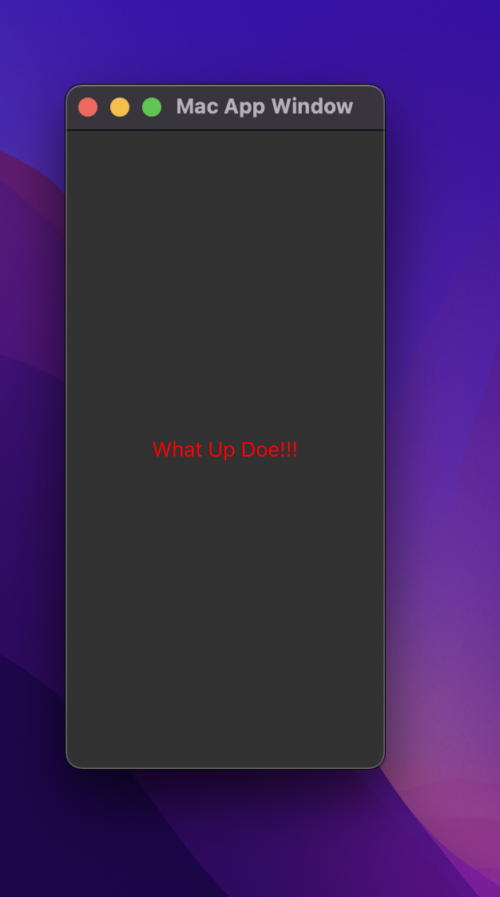

# Basic QML Frontend Application

This project is a simple "What Up Doe" project for a QML frontend application that is running Qt for C++.

## Getting Started

To get started, you need to first install Qt from the [official Qt download page](https://www.qt.io/download-qt-installer). Afterwards, locate where the Qt build tools are located on your system. Be aware that this location may be different than where Qt Creator is installed (if you are isntalling Qt Creator too). I am using Mac M1 and my location is `/opt/homebrew/Cellar/qt`

Now that you have the build tools, clone this repo into its own directory.

All you simply have to do is cd into the directory and run `qmake -project`. This will create a project file called p1.pro and it'll look like this:

```
######################################################################
# Automatically generated by qmake (3.1) Sat Nov 27 13:16:37 2021
######################################################################

TEMPLATE = app
TARGET = p1
INCLUDEPATH += .


# You can make your code fail to compile if you use deprecated APIs.
# In order to do so, uncomment the following line.
# Please consult the documentation of the deprecated API in order to know
# how to port your code away from it.
# You can also select to disable deprecated APIs only up to a certain version of Qt.
#DEFINES += QT_DISABLE_DEPRECATED_BEFORE=0x060000    # disables all the APIs deprecated before Qt 6.0.0

# Input
SOURCES += app.cpp

```

After the `INCLUDEPATH += .` part, create a newline and add `QT += gui core quick`. This will tell qmake to include those libraries in the build.

## Generating a Makefile and Executible

Now you have the build tools and the project setup how you want it! It is time to run `qmake` to generate the Makefile. Now you can simply run `make` and your project will be built. For Mac users, the app is called p1.app and you can run it by simply typing `./p1.app/Content/MacOs/p1`. You should see the "What Up Doe!!!" message in the window.

Here is an image of the application running:



## Usage

It took me a long time to realize that Qt is a frontend framework for C++ and python, but the thing is, you can use it to create full stack applications with the slots and signals integration. Well, I dont feel like writing c++ and the python iOS deployment isn't straight forward, so what I decided to do was use Qt Quick as my frontend framework and then use a python Flask server for all the hard server processing, API calls, and database handling.

Qt Quick was built to work amazing quick on the mobile, embedded, web and desktop devices. There are built in functions that will allow developers to access native device components like sensors, GPS location, and wayyyy more. Qt Quick is so good, you can even create fast rendering games, both 2D and 3D, that include smooth, but complex animations!

This is the repo to use if you like me and want a dope way to create cross platform UIs that connect to backends of your choice (you could use nodeJS, Django, etc.).

## File Updates

You should not have to update the C++ file. This file simply creates an app engine and QML app egnine, loads the main app .qml file, and then fires up the application. This is pretty much like the app.js file in react that loads the main App component which inturns loads the rest of the application.

You will need to create your qml frontend under the `resources/` folder. Rememeber that QML natively runs with javascript to add functionality, so think about adding a folder structure that supports MVVC application styling. It'll be helpful for scaling the frontend.

As you are adding QML to your UI and you import modules, make sure to add the name of the root model to the p1.pro file inside the QT array (`QT += gui core quick <add module names>`). Now, you will need to run `qmake` in the root directory. This updates the Makefile so that you can now call `make clean && make` in the root directory to clean the old binaries and create new ones based no the new Makefile.

p1.app should now be updated and you should be able to run your code by typing `p1.app/Content/MacOS/p1`

Happy Hacking!
✌🏾 [Street Coder Nate](https://www.instagram.com/streetcodernate/reels/) 👨🏾‍💻
☞ Subscribe to the [Youtube Channel!](https://www.youtube.com/channel/UCY_c3xNalxIN84_Hk3-3foQ)
